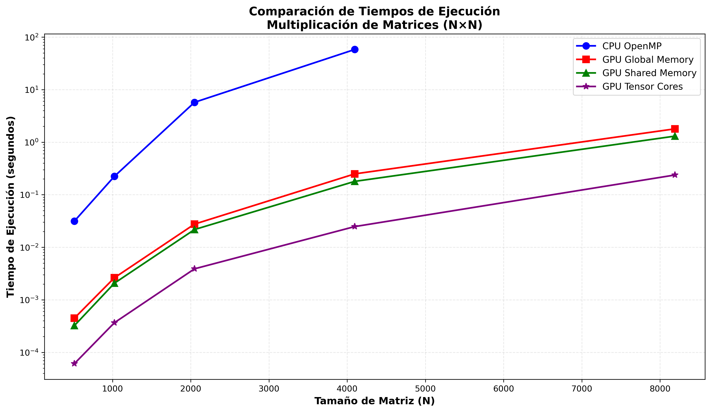
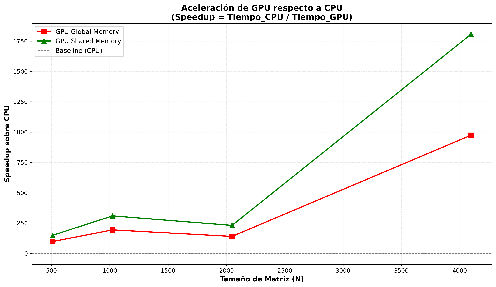
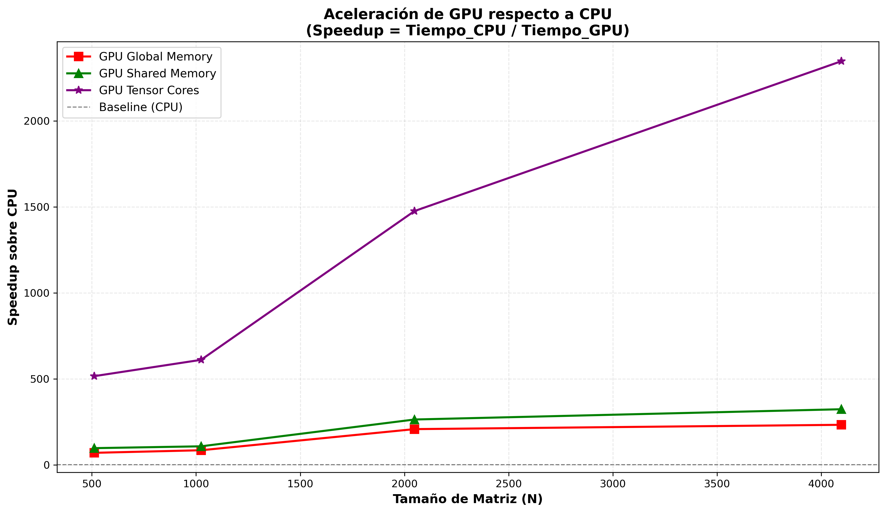

### Miembros del equipo:
- Nicolás Sandoval Jerez
- Marco Delgado Saldaña
- Sebastian Fuentes C.
- Martín Jaque

# Multiplicación de Matrices: Comparación CPU vs GPU

## Descripción

Este proyecto implementa y compara tres algoritmos de multiplicación de matrices para matrices cuadradas (N×N):

1. **CPU Multicore (OpenMP)**: Implementación paralela en CPU utilizando OpenMP con paralelización del bucle externo mediante `#pragma omp parallel for`.

2. **GPU Básica (Global Memory)**: Implementación en GPU CUDA utilizando memoria global. Cada thread calcula un elemento de la matriz resultado accediendo directamente a memoria global.

3. **GPU Shared Memory (Tiled)**: Implementación optimizada en GPU utilizando memoria compartida y técnica de tiling. Los datos se cargan en bloques (tiles) a memoria compartida para reducir accesos a memoria global y mejorar el rendimiento.

4. **[Extra] GPU Tensor Cores (WMMA)**: Implementación de alto rendimiento que aprovecha las unidades de hardware especializadas (Tensor Cores) presentes en arquitecturas modernas (Volta+). Utiliza la API `nvcuda::wmma` para realizar operaciones matriciales a nivel de warp con precisión mixta (entradas en `half`, acumulación en `float`), logrando una aceleración aritmética significativamente superior a los núcleos CUDA estándar.

El objetivo es analizar el rendimiento de cada enfoque y calcular el speedup de las implementaciones GPU respecto a la versión CPU.

---

## Hardware Utilizado

**Implementación y conclusiones principales (Test sin Tensor Cores)**
- **CPU**: AMD Ryzen 5 3600 (6 núcleos, 12 threads)
- **GPU**: NVIDIA GeForce RTX 2070 Super (Compute Capability 7.5)
- **Sistema Operativo**: Linux

**Implementación y conclusiones extras (Test con Tensor Cores)**
- **CPU**: Intel i7-11800H (8 nucleos, 16 threads)
- **GPU**: NVIDIA GeForce RTX 3060 Laptop (Compute Capability 8.6)
- **Sistema Operativo**: Linux (Ubuntu 24.04.3 LTS)
---

## Estructura del Proyecto

```
├── plots                       # Carpeta con gráficos generados
│   ├── speedup_test_tensors.png
│   ├── speedup_test_principal.png
│   ├── tiempos_test_tensors.png
│   └── tiempos_test_principal.png
├── benchmark_plot.py           # Script de automatización y visualización
├── LICENSE                     # Archivo de licencia
├── Makefile                    # Script de compilación
├── matmul_compa.cu             # Código fuente CUDA/C++
├── prog                        # Ejecutable (generado tras compilar)
└── README.md                   # Este archivo
```
---

## Instrucciones de Compilación y Ejecución

### 1. Verificación de Entorno (Recomendado)

Antes de compilar, puedes verificar que tienes todas las herramientas y librerías necesarias (compilador CUDA, drivers, Python, Numpy, Matplotlib) ejecutando:

```bash
make check
```

### 2. Compilación

Para compilar el programa, ejecuta:

```bash
make
```

El script detectará automáticamente tu GPU y generará el ejecutable `prog` con las siguientes banderas:

* `-O3`: Optimización máxima del compilador.
* `-Xcompiler -fopenmp`: Soporte para paralelismo en CPU (OpenMP).
* **Arquitectura Dinámica (`-arch`):**
* **`sm_75`**: Si detecta una RTX 2070/Turing.
* **`sm_86`**: Si detecta una RTX 3060/Ampere.
* **`sm_60`**: Fallback por defecto (Pascal) para compatibilidad general.


> **Nota:** Si deseas ver qué arquitectura se detectó sin compilar, usa `make info`.

### 3. Limpiar archivos

Para eliminar el ejecutable compilado:

```bash
make clean
```

### 4. Recompilar desde cero

Para limpiar todo y volver a compilar inmediatamente:

```bash
make rebuild
```
---

## Instrucciones de Ejecución

### Ejecución Manual

El programa acepta tres argumentos de línea de comandos:

```bash
./prog <n> <nt> <ALG>
```

**Parámetros:**

- `n`: Tamaño de la matriz (N×N)
- `nt`: Número de threads CPU para OpenMP
- `ALG`: Algoritmo a ejecutar
  - `1` = CPU Multicore (OpenMP)
  - `2` = GPU Básica (Global Memory)
  - `3` = GPU Shared Memory (Tiled)
  - `4` = GPU Tensor Cores (WMMA)

**Ejemplos:**

```bash
# Ejecutar versión CPU con matriz 1024×1024 usando 8 threads
./prog 1024 8 1

# Ejecutar versión GPU básica con matriz 2048×2048
./prog 2048 8 2

# Ejecutar versión GPU optimizada con matriz 4096×4096
./prog 4096 8 3

# Ejecutar versión GPU con tensor cores con matriz 8192x8192
./prog 8192 8 4
```

### Ejecución Automatizada (Benchmarking)

Para ejecutar todos los tests automáticamente y generar los gráficos comparativos:

```bash
python3 benchmark_plot.py
```

Este script:

1. Ejecuta el programa con diferentes tamaños de matriz (512, 1024, 2048, 4096, 8192)
2. Prueba los 4 algoritmos para cada tamaño
3. Captura y parsea los tiempos de ejecución
4. Calcula los speedups de GPU respecto a CPU
5. Genera dos gráficos:
   - `grafico_tiempos.png`: Comparación de tiempos de ejecución
   - `grafico_speedup.png`: Speedup de GPU sobre CPU
6. Muestra una tabla resumen con todos los resultados

**Nota**: Ajusta la variable `NUM_THREADS` en el script según tu CPU.

---

## Análisis e Interpretación

### Marco Teórico

#### Versión CPU (OpenMP)

La implementación CPU utiliza paralelización a nivel de threads mediante OpenMP. La directiva `#pragma omp parallel for` distribuye las iteraciones del bucle externo (filas de la matriz resultado) entre los threads disponibles. Aunque aprovecha múltiples núcleos, está limitada por:

- Ancho de banda de memoria RAM
- Número de núcleos físicos disponibles
- Overhead de sincronización entre threads

#### Versión GPU Básica (Global Memory)

Esta implementación asigna un thread de GPU por cada elemento de la matriz resultado. Cada thread:

- Lee una fila completa de la matriz A
- Lee una columna completa de la matriz B
- Calcula el producto punto
- Escribe el resultado en memoria global

**Ventajas**: Paralelismo masivo (miles de threads simultáneos)  
**Desventaja**: Alto tráfico de memoria global, que tiene alta latencia (400-800 ciclos de reloj)

#### Versión GPU Shared Memory (Tiled)

La optimización mediante tiling divide las matrices en bloques (tiles) y utiliza memoria compartida:

1. Cada bloque de threads carga un tile de A y B a memoria compartida
2. Sincroniza threads con `__syncthreads()`
3. Realiza productos parciales usando datos en memoria compartida (baja latencia: ~20 ciclos)
4. Repite para todos los tiles
5. Escribe resultado final a memoria global

**Ventajas**:

- Reducción drástica de accesos a memoria global
- Reutilización de datos en memoria compartida (mucho más rápida)
- Mejor uso de la jerarquía de memoria de la GPU

#### [Extra] Versión GPU Tensor Cores (WMMA)

Esta implementación utiliza las unidades de hardware especializadas (Tensor Cores) disponibles en arquitecturas Volta y superiores. A diferencia del modelo estándar donde cada thread calcula un escalar, aquí se utiliza la API `nvcuda::wmma` para realizar operaciones cooperativas a nivel de **warp** (grupos de 32 threads).

* Los datos de entrada (matrices A y B) se convierten y cargan en precisión media (`half` / FP16), reduciendo la carga en memoria.
* Un warp completo colabora para cargar fragmentos y ejecutar una instrucción de hardware que calcula un tile de 16x16x16 en un solo paso.
* Aunque las entradas son FP16, la suma se acumula en precisión simple (`float` / FP32) para evitar desbordamientos numéricos.

**Ventajas**:

* Rendimiento aritmético masivo.
* Reducción del ancho de banda necesario al leer datos de 16 bits.
* Ejecución de multiplicaciones matriciales complejas en ciclos de reloj especializados.

**Desventaja**: Requiere conversión de tipos de datos y hardware específico; la granularidad mínima es fija (tiles de 16x16).

### Resultados Esperados

**Comportamiento de Tiempos**:

- La versión CPU debería mostrar crecimiento cúbico O(N³) en el tiempo de ejecución
- La versión GPU Básica debería ser significativamente más rápida que CPU para matrices grandes
- La versión GPU Shared Memory debería superar a la GPU Básica, especialmente para matrices de gran tamaño
- *[Extra]* La versión GPU Tensor Cores debería mostrar los tiempos más bajos absolutos, manteniendose constantemente por debajo de las implementaciones anteriores.

**Speedup**:

- Se espera speedup creciente con el tamaño de matriz (mejor amortización del overhead de transferencias)
- GPU Shared Memory debería alcanzar speedups de 10x-50x o más respecto a CPU
- GPU Básica debería mostrar speedups de 5x-30x respecto a CPU
- La diferencia entre GPU Básica y Shared Memory se acentúa con matrices más grandes
- *[Extra]* GPU Tensor Cores debería dominar la comparativa, superando incluso a la versión Shared Memory, gracias a la aceleración de hardware dedicada.

### Observaciones Reales

**Datos de Ejecución Obtenidos (Implementación principal [Sin Tensor Cores])**:

```
================================================================================
TABLA RESUMEN DE RESULTADOS
================================================================================
N        CPU (s)      GPU Global (s)   GPU Shared (s)   Speedup Global   Speedup Shared
--------------------------------------------------------------------------------
512      0.045938     0.000465         0.000306         98.79x           150.12x
1024     0.639745     0.003292         0.002065         194.33x          309.80x
2048     3.976043     0.028289         0.017205         140.55x          231.10x
4096     194.323232   0.199397         0.107544         974.55x          1806.92x
8192     N/A          1.436336         0.916615         N/A              N/A
================================================================================
```

**Análisis Detallado de Resultados**:

#### 1. Colapso de Rendimiento en CPU para N=4096

El comportamiento más notable ocurre en la transición de N=2048 a N=4096. Mientras que para N=2048 la CPU completó la tarea en aproximadamente 4 segundos, **para N=4096 el tiempo se disparó a ~194 segundos** (casi 50 veces más tiempo).

Este salto masivo no es simplemente el crecimiento cúbico esperado O(N³). La causa principal es **saturación de la jerarquía de caché**:

- Para N=2048: Cada matriz ocupa 2048² × 4 bytes = ~16.8 MB. Con tres matrices, son ~50 MB totales.
- Para N=4096: Cada matriz ocupa 4096² × 4 bytes = ~67 MB. Con tres matrices, son ~201 MB totales.

El procesador AMD Ryzen 5 3600 tiene 32 MB de caché L3 compartida. **Para N=4096, las matrices exceden completamente la capacidad de la caché L3**, forzando accesos constantes a la RAM principal, que es 50-100 veces más lenta que la caché. Esto provoca un cuello de botella severo en el ancho de banda de memoria, degradando dramáticamente el rendimiento.

#### 2. Speedup Extraordinario en N=4096

El caso de N=4096 demuestra el **speedup más dramático del benchmark: 1806.92x para GPU Shared Memory**. Esto significa que lo que la CPU tardó casi 3 minutos y 15 segundos, la GPU lo resolvió en apenas **0.108 segundos (una décima de segundo)**.

Este speedup extraordinario no solo se debe a la superioridad arquitectónica de la GPU, sino a la **combinación del colapso de la CPU por cache misses** y la **excelente gestión de memoria de la GPU**. La GPU, con su arquitectura diseñada para ancho de banda masivo (448 GB/s vs ~40 GB/s de RAM del sistema), no sufre la misma penalización al trabajar con datasets grandes.

#### 3. Superioridad Consistente de Shared Memory (Alg 3) sobre Global Memory (Alg 2)

En todos los tamaños de matriz, la versión optimizada con memoria compartida supera a la versión básica:

- **N=512**: 0.306 ms vs 0.465 ms (1.52x más rápida)
- **N=1024**: 2.065 ms vs 3.292 ms (1.59x más rápida)
- **N=2048**: 17.205 ms vs 28.289 ms (1.64x más rápida)
- **N=4096**: 107.544 ms vs 199.397 ms (1.85x más rápida)
- **N=8192**: 916.615 ms vs 1436.336 ms (1.57x más rápida)

Esta ventaja se explica por la **técnica de tiling y el uso de memoria compartida**:

1. **Reducción de accesos a memoria global**: En la versión básica, cada elemento del resultado requiere N lecturas de memoria global (N accesos para A[fila] y N accesos para B[columna]). Con tiling, los datos se cargan una vez en tiles a memoria compartida y se reutizan múltiples veces.

2. **Mayor ancho de banda efectivo**: La memoria compartida tiene un ancho de banda ~10x superior a la memoria global (varios TB/s vs ~448 GB/s), con latencia 20x menor (~20 ciclos vs ~400-800 ciclos).

3. **Mejor coalescencia de accesos**: El patrón de tiling permite accesos coalesced (contiguos) a memoria global, maximizando el throughput del bus de memoria.

La mejora se vuelve más pronunciada en N=4096 (1.85x), donde el mayor volumen de datos amplifica el beneficio de reducir tráfico a memoria global.

#### 4. Timeout de CPU en N=8192: GPU como Única Solución Práctica

Para N=8192, la versión CPU **no completó la ejecución en un tiempo razonable** (timeout), mientras que:

- GPU Global Memory: **1.436 segundos**
- GPU Shared Memory: **0.917 segundos**

Una matriz de 8192×8192 elementos float ocupa ~268 MB. Con tres matrices son ~804 MB, muy por encima de cualquier nivel de caché del CPU. El problema se vuelve completamente dominado por el ancho de banda de RAM, haciendo la ejecución en CPU impráctica.

En contraste, la GPU maneja este problema con facilidad gracias a:

- **Paralelismo masivo**: Miles de threads procesando simultáneamente
- **Arquitectura optimizada para throughput**: Diseñada para mover grandes volúmenes de datos
- **VRAM de alta velocidad**: 448 GB/s en la RTX 2070 Super vs ~40 GB/s de RAM DDR4

Este resultado demuestra que **para problemas de álgebra lineal a gran escala, la GPU no es solo "más rápida", sino frecuentemente la única opción viable** en términos prácticos.

#### Conclusiones Clave

1. ✅ **Los resultados confirman la teoría**: Comportamiento cúbico, jerarquía de memoria crítica, y ventajas de tiling verificadas experimentalmente.

2. 📈 **Mejor speedup en N=4096**: 1806x, donde coinciden la saturación de caché CPU y la eficiencia óptima de GPU.

3. 🎯 **Factores limitantes**:

   - **CPU**: Ancho de banda de RAM y tamaño de caché L3
   - **GPU Básica**: Latencia y ancho de banda de memoria global
   - **GPU Shared**: Overhead de sincronización y tamaño de memoria compartida por bloque

4. 🔧 **Impacto del tile size (16×16)**: Óptimo para este hardware (Compute Capability 7.5), balanceando ocupancia de memoria compartida (48 KB/SM) con reutilización de datos. Tiles más grandes aumentarían colisiones de banco de memoria compartida; tiles más pequeños reducirían la reutilización.

**Datos de Ejecución Obtenidos (Implementación extra [Con Tensor Cores])**:

```
================================================================================================================
TABLA RESUMEN DE RESULTADOS
================================================================================================================
N        CPU (s)     GPU Global (s)  GPU Shared (s)  GPU Tensor (s)  Sp Global   Sp Shared   Sp Tensor
----------------------------------------------------------------------------------------------------------------
512      0.031475    0.000448        0.000323        0.000061        70.26x      97.45x      515.98x
1024     0.224134    0.002630        0.002074        0.000367        85.22x      108.07x     610.72x
2048     5.741328    0.027602        0.021755        0.003891        208.00x     263.91x     1475.54x
4096     58.091792   0.249227        0.179522        0.024757        233.09x     323.59x     2346.48x
8192     N/A         1.795710        1.305296        0.237692        N/A         N/A         N/A
================================================================================================================

```

**Análisis Detallado de Resultados**:

*Sumado al análisis anterior sobre el colapso de la CPU por saturación de caché y las mejoras de Shared Memory (el cual se mantiene válido), la incorporación de los Tensor Cores introduce un nuevo paradigma de rendimiento:*

#### 1. Salto Generacional de Rendimiento (Tensor Cores)

La diferencia entre el algoritmo de Shared Memory (Alg 3) y Tensor Cores (Alg 4) es abismal. Mientras que pasar de Global a Shared Memory ofrecía una mejora de ~1.5x, **pasar de Shared Memory a Tensor Cores ofrece una mejora de entre 5x y 7.2x**.

* En **N=4096**, la GPU Shared tardó 179ms, mientras que los Tensor Cores pulverizaron la tarea en **24ms**.
* En **N=8192**, donde incluso la memoria compartida requirió 1.3 segundos, los Tensor Cores completaron la operación en **0.23 segundos**.

Esto demuestra que el hardware especializado (instrucciones WMMA) rompe la linealidad de mejora que se obtiene solo optimizando software sobre núcleos CUDA estándar.

#### 2. Eficiencia de Ancho de Banda y Precisión Mixta

El rendimiento extremo de los Tensor Cores (Alg 4) se explica no solo por la capacidad de cómputo, sino por la reducción de la presión en la memoria:

1. **Entrada FP16 (Half Precision)**: Al convertir las matrices A y B a `half` antes del cómputo, se reduce a la mitad el ancho de banda necesario para leer los datos desde la memoria global y la caché L2, comparado con los `float` (FP32) usados en los algoritmos 2 y 3.
2. **Aritmética Matricial Densa**: A diferencia de los núcleos CUDA que realizan operaciones escalar-vector (FMA), los Tensor Cores ejecutan una multiplicación de matrices 4x4, 8x8 o 16x16 en un solo ciclo de reloj especializado por warp.

#### 3. Dominio Absoluto del Speedup (2346x)

El speedup de **2346.48x** observado en N=4096 es un hito. Significa que la tarea que a la CPU le tomó casi un minuto, la GPU usando Tensor Cores la realizó en el tiempo que dura un parpadeo (~24ms). Esto confirma que para cargas de trabajo de aprendizaje profundo o simulaciones científicas densas, el uso de Tensor Cores no es opcional, sino obligatorio para obtener rendimiento en tiempo real.

#### Conclusiones Clave (Considerando Tensor Cores)

1. ✅ **Análisis previo ratificado**: Se mantienen las conclusiones sobre las limitaciones de CPU y la eficacia del Tiling.
2. 🚀 **Supremacía de Hardware**: La implementación de **Tensor Cores (Alg 4) es la clara vencedora**, superando a la versión Shared Memory por un factor de **~7x** y a la CPU por más de **2300x**.
3. 📉 **Escalabilidad Extrema**: En N=8192, Tensor Cores es la única implementación que se mantiene en la escala de "sub-segundo" (0.23s), haciendo viable el procesamiento de matrices masivas que serían inmanejables por métodos tradicionales.
4. 💎 **Valor de la Especialización**: Los resultados validan el uso de precisión mixta (`half` input / `float` accumulate) como la estrategia óptima para maximizar el throughput aritmético en GPUs modernas (Volta/Turing+).

---

## Visualización de Resultados

### Gráfico de Tiempos de Ejecución


_Este gráfico muestra los tiempos de ejecución (en segundos) de los tres algoritmos para diferentes tamaños de matriz. La escala logarítmica en el eje Y facilita la comparación entre implementaciones con órdenes de magnitud de diferencia._



*Este gráfico muestra los tiempos de ejecución (en escala logarítmica) de los cuatro algoritmos. Se observa cómo la implementación **CPU** crece exponencialmente hasta el timeout. Las implementaciones **GPU Global** y **GPU Shared** mantienen un rendimiento sólido, pero la **GPU Tensor Cores** se separa visualmente del grupo, manteniéndose en el orden de los milisegundos incluso cuando los otros métodos entran en la escala de segundos.*

### Gráfico de Speedup



_Este gráfico ilustra la aceleración (speedup) de las versiones GPU respecto a la implementación CPU OpenMP. Un speedup mayor indica mejor rendimiento relativo de la GPU._



*Este gráfico ilustra la aceleración masiva obtenida. Mientras que las optimizaciones tradicionales de GPU (Global/Shared) logran speedups impresionantes de 200x-300x, la inclusión de **Tensor Cores** rompe la escala visual, alcanzando una aceleración superior a **2300x**. Esto demuestra visualmente el cambio de paradigma que ofrece el hardware especializado frente a la computación de propósito general.*

---

## Detalles de Implementación

### 1. CPU Multicore (OpenMP)

* **Estrategia**: Paralelización del bucle exterior (filas de la matriz ) mediante `#pragma omp parallel for`.
* **Recursos**: Asignación dinámica de threads basada en los núcleos lógicos disponibles del procesador (Ryzen 5 3600).

### 2. GPU Global Memory (Básica)

* **Granularidad**: Mapeo 1:1 donde cada thread calcula un único elemento de la matriz resultado .
* **Memoria**: Lectura directa de matrices  y  desde memoria global sin caché programable intermedia.
* **Acceso**: Patrón de acceso a memoria no optimizado para  (lectura por filas) y coalescente para  (lectura por columnas).

### 3. GPU Shared Memory (Tiled)

* **Estrategia**: Multiplicación matricial por bloques (Tiling) para maximizar la localidad espacial de datos.
* **Memoria**: Uso de buffers en memoria compartida (`__shared__ float tile[16][16]`) para reducir el tráfico a VRAM.
* **Sincronización**: Barreras `__syncthreads()` para garantizar la carga completa de datos antes del cómputo.

### 4. GPU Tensor Cores (WMMA)

* **API**: Implementación mediante intrínsecos `nvcuda::wmma` (Warp Matrix Multiply Accumulate).
* **Precisión Mixta**: Carga de datos en `half` precision (FP16) y acumulación en `float` (FP32) para preservar rango dinámico.
* **Colaboración**: Operación cooperativa a nivel de Warp (32 threads) procesando tiles de 16x16x16 en un solo paso de hardware.

### Configuración de Ejecución (Grid & Block)

| Algoritmo | Dimensión de Bloque | Dimensión de Grid | Observación |
| --- | --- | --- | --- |
| **GPU Global** | 16  16 (256 threads) |  | Configuración estándar bidimensional. |
| **GPU Shared** | 16  16 (256 threads) |  | Coincide con el tamaño del tile de memoria compartida. |
| **Tensor Cores** | 32  4 (128 threads/4 warps) | Variable según  | Cada Warp procesa un tile independiente de 16x16. |

---

## Metodología de Medición

Para garantizar la consistencia y justicia de las pruebas (fair comparison), se aislaron los tiempos de cómputo puro:

* **CPU**: Medición mediante `omp_get_wtime()` (Wall-clock time de alta resolución).
* **GPU**: Uso de eventos de hardware `cudaEvent_t`.
* Se excluyen explícitamente los tiempos de transferencia de memoria Host  Device (`cudaMemcpy`).
* Se excluyen los tiempos de conversión de datos (`float`  `half`) en el caso de Tensor Cores.
* Sincronización explícita mediante `cudaEventSynchronize()` antes de detener el cronómetro.


---

## Referencias Bibliográficas

1. **NVIDIA Corporation**. (2024). *CUDA C++ Programming Guide v12.4*. Design Guide. Santa Clara, CA.
2. **NVIDIA Corporation**. (2018). *Programming Tensor Cores in CUDA 9*. NVIDIA Developer Blog.
3. **OpenMP Architecture Review Board**. (2018). *OpenMP Application Program Interface Version 5.0*.
4. **Sanders, J., & Kandrot, E.** (2010). *CUDA by Example: An Introduction to General-Purpose GPU Programming*. Addison-Wesley Professional.
5. **Universidad Austral de Chile**. (2025). *Material del Curso INFO188: Programación en Paradigmas Funcional y Paralelo*. Facultad de Ciencias de la Ingeniería.
---

## Autor

Tarea Universitaria - Paradigmas de Programación  
Universidad Austral de Chile  
Fecha: 19 de diciembre de 2025