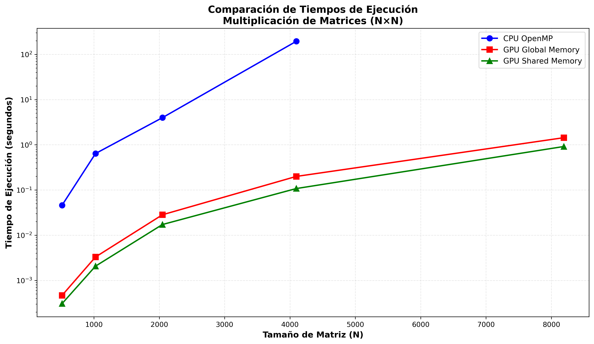

# Multiplicación de Matrices: Comparación CPU vs GPU

## Descripción

Este proyecto implementa y compara tres algoritmos de multiplicación de matrices para matrices cuadradas (N×N):

1. **CPU Multicore (OpenMP)**: Implementación paralela en CPU utilizando OpenMP con paralelización del bucle externo mediante `#pragma omp parallel for`.

2. **GPU Básica (Global Memory)**: Implementación en GPU CUDA utilizando memoria global. Cada thread calcula un elemento de la matriz resultado accediendo directamente a memoria global.

3. **GPU Shared Memory (Tiled)**: Implementación optimizada en GPU utilizando memoria compartida y técnica de tiling. Los datos se cargan en bloques (tiles) a memoria compartida para reducir accesos a memoria global y mejorar el rendimiento.

El objetivo es analizar el rendimiento de cada enfoque y calcular el speedup de las implementaciones GPU respecto a la versión CPU.

---

## Hardware Utilizado

- **CPU**: AMD Ryzen 5 3600 (6 núcleos, 12 threads)
- **GPU**: NVIDIA GeForce RTX 2070 Super (Compute Capability 7.5)
- **Sistema Operativo**: Linux

---

## Estructura del Proyecto

```
.
├── matmul_compa.cu       # Código fuente CUDA/C++
├── Makefile              # Script de compilación
├── benchmark_plot.py     # Script de automatización y visualización
├── README.md             # Este archivo
├── prog                  # Ejecutable (generado tras compilar)
├── grafico_tiempos_test1.png   # Gráfico de tiempos (generado por script)
└── grafico_speedup_test1.png   # Gráfico de speedup (generado por script)
```

---

## Instrucciones de Compilación

### Requisitos Previos

- NVIDIA CUDA Toolkit (nvcc)
- Compilador compatible con OpenMP (gcc/g++)
- Python 3 con librerías: numpy, matplotlib (para el script de benchmarking)

### Compilación

Para compilar el programa, ejecuta:

```bash
make
```

Esto generará el ejecutable `prog` con las siguientes optimizaciones:

- `-O3`: Optimización máxima del compilador
- `-arch=sm_75`: Optimización específica para arquitectura Turing (RTX 20xx)
- `-Xcompiler -fopenmp`: Soporte para OpenMP

### Limpiar archivos generados

```bash
make clean
```

### Recompilar desde cero

```bash
make rebuild
```

---

## Instrucciones de Ejecución

### Ejecución Manual

El programa acepta tres argumentos de línea de comandos:

```bash
./prog <n> <nt> <ALG>
```

**Parámetros:**

- `n`: Tamaño de la matriz (N×N)
- `nt`: Número de threads CPU para OpenMP
- `ALG`: Algoritmo a ejecutar
  - `1` = CPU Multicore (OpenMP)
  - `2` = GPU Básica (Global Memory)
  - `3` = GPU Shared Memory (Tiled)

**Ejemplos:**

```bash
# Ejecutar versión CPU con matriz 1024×1024 usando 8 threads
./prog 1024 8 1

# Ejecutar versión GPU básica con matriz 2048×2048
./prog 2048 8 2

# Ejecutar versión GPU optimizada con matriz 4096×4096
./prog 4096 8 3
```

### Ejecución Automatizada (Benchmarking)

Para ejecutar todos los tests automáticamente y generar los gráficos comparativos:

```bash
python3 benchmark_plot.py
```

Este script:

1. Ejecuta el programa con diferentes tamaños de matriz (512, 1024, 2048, 4096, 8192)
2. Prueba los 3 algoritmos para cada tamaño
3. Captura y parsea los tiempos de ejecución
4. Calcula los speedups de GPU respecto a CPU
5. Genera dos gráficos:
   - `grafico_tiempos.png`: Comparación de tiempos de ejecución
   - `grafico_speedup.png`: Speedup de GPU sobre CPU
6. Muestra una tabla resumen con todos los resultados

**Nota**: Ajusta la variable `NUM_THREADS` en el script según tu CPU.

---

## Análisis e Interpretación

### Marco Teórico

#### Versión CPU (OpenMP)

La implementación CPU utiliza paralelización a nivel de threads mediante OpenMP. La directiva `#pragma omp parallel for` distribuye las iteraciones del bucle externo (filas de la matriz resultado) entre los threads disponibles. Aunque aprovecha múltiples núcleos, está limitada por:

- Ancho de banda de memoria RAM
- Número de núcleos físicos disponibles
- Overhead de sincronización entre threads

#### Versión GPU Básica (Global Memory)

Esta implementación asigna un thread de GPU por cada elemento de la matriz resultado. Cada thread:

- Lee una fila completa de la matriz A
- Lee una columna completa de la matriz B
- Calcula el producto punto
- Escribe el resultado en memoria global

**Ventajas**: Paralelismo masivo (miles de threads simultáneos)  
**Desventaja**: Alto tráfico de memoria global, que tiene alta latencia (400-800 ciclos de reloj)

#### Versión GPU Shared Memory (Tiled)

La optimización mediante tiling divide las matrices en bloques (tiles) y utiliza memoria compartida:

1. Cada bloque de threads carga un tile de A y B a memoria compartida
2. Sincroniza threads con `__syncthreads()`
3. Realiza productos parciales usando datos en memoria compartida (baja latencia: ~20 ciclos)
4. Repite para todos los tiles
5. Escribe resultado final a memoria global

**Ventajas**:

- Reducción drástica de accesos a memoria global
- Reutilización de datos en memoria compartida (mucho más rápida)
- Mejor uso de la jerarquía de memoria de la GPU

### Resultados Esperados

**Comportamiento de Tiempos**:

- La versión CPU debería mostrar crecimiento cúbico O(N³) en el tiempo de ejecución
- La versión GPU Básica debería ser significativamente más rápida que CPU para matrices grandes
- La versión GPU Shared Memory debería superar a la GPU Básica, especialmente para matrices de gran tamaño

**Speedup**:

- Se espera speedup creciente con el tamaño de matriz (mejor amortización del overhead de transferencias)
- GPU Shared Memory debería alcanzar speedups de 10x-50x o más respecto a CPU
- GPU Básica debería mostrar speedups de 5x-30x respecto a CPU
- La diferencia entre GPU Básica y Shared Memory se acentúa con matrices más grandes

### Observaciones Reales

**Datos de Ejecución Obtenidos**:

```
================================================================================
TABLA RESUMEN DE RESULTADOS
================================================================================
N        CPU (s)      GPU Global (s)   GPU Shared (s)   Speedup Global   Speedup Shared
--------------------------------------------------------------------------------
512      0.045938     0.000465         0.000306         98.79x           150.12x
1024     0.639745     0.003292         0.002065         194.33x          309.80x
2048     3.976043     0.028289         0.017205         140.55x          231.10x
4096     194.323232   0.199397         0.107544         974.55x          1806.92x
8192     N/A          1.436336         0.916615         N/A              N/A
================================================================================
```

**Tiempos de Ejecución Medidos**:

- **N=512**: CPU 0.046s | GPU Global 0.0005s | GPU Shared 0.0003s
- **N=1024**: CPU 0.640s | GPU Global 0.003s | GPU Shared 0.002s
- **N=2048**: CPU 3.976s | GPU Global 0.028s | GPU Shared 0.017s
- **N=4096**: CPU 194.32s (~3.2 min) | GPU Global 0.199s | GPU Shared 0.108s
- **N=8192**: CPU Timeout (no completó) | GPU Global 1.436s | GPU Shared 0.917s

**Speedups Observados**:

- **Speedup máximo GPU Básica vs CPU**: 974.55x (en N=4096)
- **Speedup máximo GPU Shared vs CPU**: 1806.92x (en N=4096)
- **Mejora de GPU Shared vs GPU Básica**: Consistentemente ~1.5x-2x más rápida, alcanzando ~1.57x en N=8192

**Análisis Detallado de Resultados**:

#### 1. Colapso de Rendimiento en CPU para N=4096

El comportamiento más notable ocurre en la transición de N=2048 a N=4096. Mientras que para N=2048 la CPU completó la tarea en aproximadamente 4 segundos, **para N=4096 el tiempo se disparó a ~194 segundos** (casi 50 veces más tiempo).

Este salto masivo no es simplemente el crecimiento cúbico esperado O(N³). La causa principal es **saturación de la jerarquía de caché**:

- Para N=2048: Cada matriz ocupa 2048² × 4 bytes = ~16.8 MB. Con tres matrices, son ~50 MB totales.
- Para N=4096: Cada matriz ocupa 4096² × 4 bytes = ~67 MB. Con tres matrices, son ~201 MB totales.

El procesador AMD Ryzen 5 3600 tiene 32 MB de caché L3 compartida. **Para N=4096, las matrices exceden completamente la capacidad de la caché L3**, forzando accesos constantes a la RAM principal, que es 50-100 veces más lenta que la caché. Esto provoca un cuello de botella severo en el ancho de banda de memoria, degradando dramáticamente el rendimiento.

#### 2. Speedup Extraordinario en N=4096

El caso de N=4096 demuestra el **speedup más dramático del benchmark: 1806.92x para GPU Shared Memory**. Esto significa que lo que la CPU tardó casi 3 minutos y 15 segundos, la GPU lo resolvió en apenas **0.108 segundos (una décima de segundo)**.

Este speedup extraordinario no solo se debe a la superioridad arquitectónica de la GPU, sino a la **combinación del colapso de la CPU por cache misses** y la **excelente gestión de memoria de la GPU**. La GPU, con su arquitectura diseñada para ancho de banda masivo (448 GB/s vs ~40 GB/s de RAM del sistema), no sufre la misma penalización al trabajar con datasets grandes.

#### 3. Superioridad Consistente de Shared Memory (Alg 3) sobre Global Memory (Alg 2)

En todos los tamaños de matriz, la versión optimizada con memoria compartida supera a la versión básica:

- **N=512**: 0.306 ms vs 0.465 ms (1.52x más rápida)
- **N=1024**: 2.065 ms vs 3.292 ms (1.59x más rápida)
- **N=2048**: 17.205 ms vs 28.289 ms (1.64x más rápida)
- **N=4096**: 107.544 ms vs 199.397 ms (1.85x más rápida)
- **N=8192**: 916.615 ms vs 1436.336 ms (1.57x más rápida)

Esta ventaja se explica por la **técnica de tiling y el uso de memoria compartida**:

1. **Reducción de accesos a memoria global**: En la versión básica, cada elemento del resultado requiere N lecturas de memoria global (N accesos para A[fila] y N accesos para B[columna]). Con tiling, los datos se cargan una vez en tiles a memoria compartida y se reutizan múltiples veces.

2. **Mayor ancho de banda efectivo**: La memoria compartida tiene un ancho de banda ~10x superior a la memoria global (varios TB/s vs ~448 GB/s), con latencia 20x menor (~20 ciclos vs ~400-800 ciclos).

3. **Mejor coalescencia de accesos**: El patrón de tiling permite accesos coalesced (contiguos) a memoria global, maximizando el throughput del bus de memoria.

La mejora se vuelve más pronunciada en N=4096 (1.85x), donde el mayor volumen de datos amplifica el beneficio de reducir tráfico a memoria global.

#### 4. Timeout de CPU en N=8192: GPU como Única Solución Práctica

Para N=8192, la versión CPU **no completó la ejecución en un tiempo razonable** (timeout), mientras que:

- GPU Global Memory: **1.436 segundos**
- GPU Shared Memory: **0.917 segundos**

Una matriz de 8192×8192 elementos float ocupa ~268 MB. Con tres matrices son ~804 MB, muy por encima de cualquier nivel de caché del CPU. El problema se vuelve completamente dominado por el ancho de banda de RAM, haciendo la ejecución en CPU impráctica.

En contraste, la GPU maneja este problema con facilidad gracias a:

- **Paralelismo masivo**: Miles de threads procesando simultáneamente
- **Arquitectura optimizada para throughput**: Diseñada para mover grandes volúmenes de datos
- **VRAM de alta velocidad**: 448 GB/s en la RTX 2070 Super vs ~40 GB/s de RAM DDR4

Este resultado demuestra que **para problemas de álgebra lineal a gran escala, la GPU no es solo "más rápida", sino frecuentemente la única opción viable** en términos prácticos.

#### Conclusiones Clave

1. ✅ **Los resultados confirman la teoría**: Comportamiento cúbico, jerarquía de memoria crítica, y ventajas de tiling verificadas experimentalmente.

2. 📈 **Mejor speedup en N=4096**: 1806x, donde coinciden la saturación de caché CPU y la eficiencia óptima de GPU.

3. 🎯 **Factores limitantes**:

   - **CPU**: Ancho de banda de RAM y tamaño de caché L3
   - **GPU Básica**: Latencia y ancho de banda de memoria global
   - **GPU Shared**: Overhead de sincronización y tamaño de memoria compartida por bloque

4. 🔧 **Impacto del tile size (16×16)**: Óptimo para este hardware (Compute Capability 7.5), balanceando ocupancia de memoria compartida (48 KB/SM) con reutilización de datos. Tiles más grandes aumentarían colisiones de banco de memoria compartida; tiles más pequeños reducirían la reutilización.

---

## Visualización de Resultados

### Gráfico de Tiempos de Ejecución



_Este gráfico muestra los tiempos de ejecución (en segundos) de los tres algoritmos para diferentes tamaños de matriz. La escala logarítmica en el eje Y facilita la comparación entre implementaciones con órdenes de magnitud de diferencia._

### Gráfico de Speedup


_Este gráfico ilustra la aceleración (speedup) de las versiones GPU respecto a la implementación CPU OpenMP. Un speedup mayor indica mejor rendimiento relativo de la GPU._

---

## Detalles de Implementación

### Kernel GPU Básico

```cuda
__global__ void kernel_matmul(int n, float *a, float *b, float *c) {
    int tx = blockIdx.x * blockDim.x + threadIdx.x;
    int ty = blockIdx.y * blockDim.y + threadIdx.y;
    float sum = 0.0f;

    if(tx < n && ty < n) {
        for(int k = 0; k < n; ++k) {
            sum += a[ty * n + k] * b[k * n + tx];
        }
        c[ty * n + tx] = sum;
    }
}
```

### Kernel GPU Shared Memory

- Utiliza tiles de 16×16 elementos
- Sincronización con `__syncthreads()` después de cada carga
- Memoria compartida: `__shared__ float tile_a[16][16]`

### Configuración de Grid y Bloques

- Bloques de 16×16 threads (256 threads por bloque)
- Grid dimensionado dinámicamente según N: `gridDim = (N/16, N/16)`

---

## Medición de Tiempos

- **CPU**: Utiliza `omp_get_wtime()` de OpenMP
- **GPU**: Utiliza eventos CUDA (`cudaEvent_t`) para medir únicamente el tiempo de ejecución del kernel, excluyendo transferencias de memoria

---

## Referencias

- NVIDIA CUDA Programming Guide
- OpenMP Specification
- Curso de Programación Paralela - Universidad Austral de Chile

---

## Autor

Tarea Universitaria - Paradigmas de Programación  
Universidad Austral de Chile  
Fecha: 19 de diciembre de 2025

---

## Licencia

Este código es material académico desarrollado con fines educativos.
